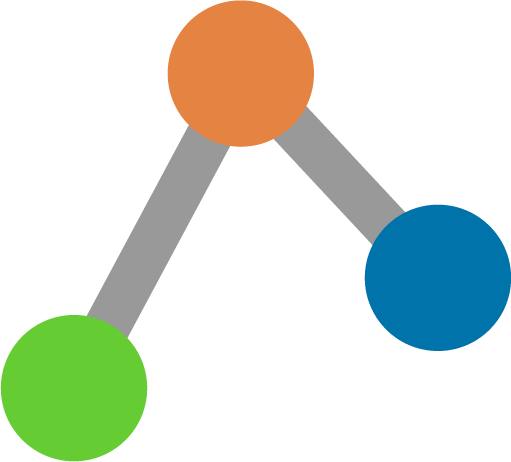

    

 TreeViz 

The best tree data-structures visualization tool.   

## How to use TreeViz
There are multiple different ways to create a tree including: starting with and empty tree
and adding or removing values using + or - buttons, using tree string structure to describe a
particular tree then perform operations on it, and generating a random tree using random tree
generator by pressing Generate button. Here are the steps needed to perform the most common operations:

--------------------------
##### Also checkout our youtube channel for half a minute tutorials [→](https://www.youtube.com/channel/UCK7IL7eG_Dmf0xCuL5gvotg)
--------------------------
### Generating random tree
- Choose a tree type 
- Choose the range of numbers
- Choose the number of nodes wanted
- Click generate

### Building a tree 
There are multiple ways to build a tree including:

**1. By inserting numbers**         
   - Add the first number into tree description and press go
   - Add other numbers into add a number text input and press +
                        

**2. By tree sequence**
   - Enter a sequence of additions and deletions separated by commas
   - Press GO

   **What is a tree sequence?**

   It is a sequence of comma-separated numbers that describe insertions and deletions that happened to the tree.
      - To add an insertion into the sequence just add the number.
      - To add a deletions into the sequence add letter 'd' before the number.

      Ex: 1,2,9,10,d2,11,15,d10

**3. By tree description string**
   - Enter a tree string into 'Describe a tree' text field
   - Press GO

   **What is tree string?**

      It is a string that explains the tree such that:
      - numbers separated by commas and between {'{}'} belonges to the same node
      - Each node's children are separated by commas and placed between ()

      Example tree string : {'{5,7}({3}{6}{8,9})'}

      Corresponding tree :

                         {5,7}
                       /   |   \
                      {3} {6} {8,9}

### Converting a tree into another type:
- Click on use tree at the top right of the tree
- Choose the target tree type 
- Click GO
                            
### View the tree in full screen
- Click on []'

### Play the tree animation
- Click on play button

### Stop tree animation
- Click on stop button

### Zoom in the tree 
- Ctrl + scroll up

### Zoom out the tree 
- Ctrl + scroll down

### Fit the tree in the screen
- Click fit button